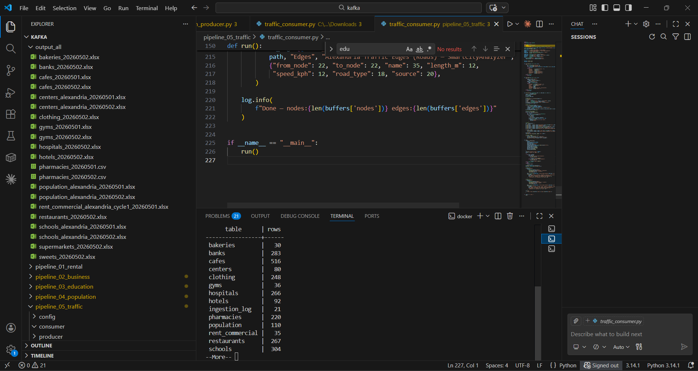
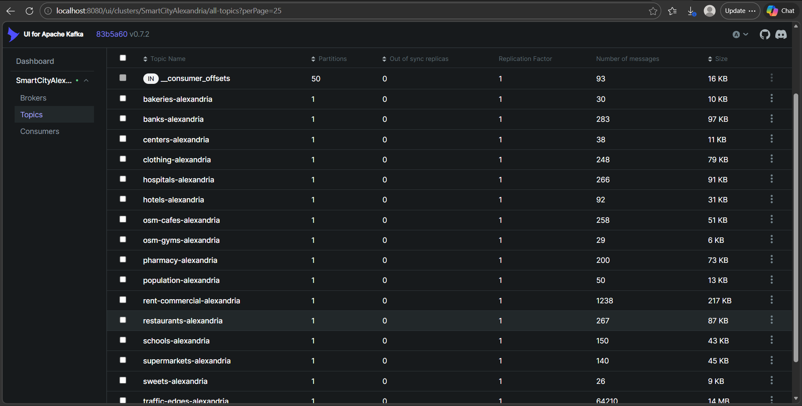

# 🏙️ SmartCity Analyzer — Phase 1
### Real-time Urban Data Pipeline · Alexandria, Egypt


---

## 💡 Why This Project?

Alexandria is Egypt's second-largest city with **5+ million residents** and rapidly growing commercial activity — yet there's **no unified, structured data source** for urban infrastructure, businesses, or population distribution across its districts.

SmartCity Analyzer Phase 1 solves this by building a **production-grade data pipeline** that automatically collects, streams, and stores real-time urban data across **all 50 districts** of Alexandria. The output is a clean, analytics-ready database covering everything from commercial rent to road networks.

> This is Phase 1 of a larger SmartCity platform. It focuses entirely on **data collection and storage** — building the reliable foundation that all future analysis depends on.

---

## 🎯 What It Does

| | |
|---|---|
| **Collects** | Business locations, schools, hospitals, commercial rent, population stats, and road networks |
| **Streams** | All data flows through Apache Kafka in real-time, decoupling sources from storage |
| **Stores** | Raw data lands in a structured PostgreSQL Bronze Layer, ready for downstream use |
| **Scales** | Fully containerized with Docker; reruns automatically every 6 months via APScheduler |

---

## 🏗️ Architecture

```
┌─────────────────────────────────────────────────────┐
│                    DATA SOURCES                      │
│                                                     │
│  OpenStreetMap    Aqarmap.com    WorldPop / CAPMAS  │
│  (Overpass API)  (Web Scraping)   (Population API)  │
│       OSMnx + SQLite (Road Network)                 │
└───────────────────────┬─────────────────────────────┘
                        │
                        ▼
┌─────────────────────────────────────────────────────┐
│               APACHE KAFKA (5 Topics)               │
│                                                     │
│  pipeline_01 → rent-commercial-alexandria           │
│  pipeline_02 → osm-cafes / gyms / restaurants ...  │
│  pipeline_03 → schools-alexandria / centers         │
│  pipeline_04 → population-alexandria                │
│  pipeline_05 → traffic-nodes / traffic-edges        │
└───────────────────────┬─────────────────────────────┘
                        │
                        ▼
┌─────────────────────────────────────────────────────┐
│          BRONZE LAYER — PostgreSQL (schema: bronze) │
│                                                     │
│  rent_commercial · cafes · gyms · restaurants       │
│  bakeries · hotels · hospitals · banks · clothing   │
│  supermarkets · sweets · pharmacies · schools       │
│  centers · population · traffic_nodes · edges       │
└─────────────────────────────────────────────────────┘
```

---

## 📊 Data Coverage

**City:** Alexandria, Egypt &nbsp;|&nbsp; **Districts:** 50 (Sidi Gaber → Borg El Arab)

```
Bounding Box → lat: 30.9 – 31.4  |  lon: 29.5 – 30.2
```

| Pipeline | Source | Data Collected | Volume |
|----------|--------|----------------|--------|
| 01 — Commercial Rent | Aqarmap (scraping) | Area (m²), Rent (EGP), Location | Per district |
| 02 — Businesses | OpenStreetMap + scraping | Name, lat/lon for 10 business types | City-wide |
| 03 — Education | OpenStreetMap | Schools & centers: name, type, capacity | City-wide |
| 04 — Population | WorldPop + CAPMAS + VIIRS | District population, nightlight intensity | 50 districts |
| 05 — Road Network | OSMnx + SQLite | Nodes & edges of Alexandria road graph | **81,768 records** |

---

## 📸 Screenshots

> **Bronze Layer — PostgreSQL Data**



> **Kafka Topic Flow**



---

## 📁 Project Structure

```
SmartCity_Phase1/
└── kafka/
    ├── docker-compose.master.yml       ← runs all 5 pipelines at once
    │
    ├── pipeline_01_rental/
    │   ├── producer/aqarmap_producer.py
    │   ├── consumer/aqarmap_consumer.py
    │   └── docker-compose.yml
    │
    ├── pipeline_02_business/
    │   ├── producer/osm_producer.py
    │   ├── producers/pharmacy_producer.py
    │   ├── consumer/consumer.py
    │   └── docker-compose.yml
    │
    ├── pipeline_03_education/
    │   ├── education_producer.py
    │   ├── education_consumer.py
    │   └── docker-compose.yml
    │
    ├── pipeline_04_population/
    │   ├── population_producer.py
    │   ├── population_consumer.py
    │   └── docker-compose.yml
    │
    ├── pipeline_05_traffic/
    │   ├── traffic_producer.py
    │   ├── traffic_consumer.py
    │   └── docker-compose.yml
    │
    ├── pipeline_bronze_postgres/
    │   ├── bronze_loader.py            ← watches output_all → loads to PostgreSQL
    │   ├── init.sql                    ← table definitions
    │   └── docker-compose.yml
    │
    └── output_all/                     ← raw xlsx / csv output files
```

---

## 🚀 Quick Start

**Prerequisites:** Docker Desktop · Docker Compose · Git

```bash
# 1. Clone the repo
git clone https://github.com/nora-alaa1/SmartCityAnalyzer.git
cd SmartCityAnalyzer/SmartCity_Phase1_AllPipelines/SmartCity_Phase1/kafka

# 2. Run all pipelines at once
docker compose -f docker-compose.master.yml up -d

# 3. Verify containers are running
docker ps

# 4. Check data landed in PostgreSQL
docker exec -it smartcity-postgres psql -U smartcity -d smartcity \
  -c "SELECT schemaname, tablename FROM pg_tables WHERE schemaname = 'bronze';"
```

To run a single pipeline only:
```bash
cd pipeline_01_rental
docker compose up -d
```

---

## ⚙️ Environment Variables

```env
PG_HOST=postgres
PG_PORT=5432
PG_DB=smartcity
PG_USER=smartcity
PG_PASSWORD=smartcity123
OUTPUT_DIR=/app/output
POLL_INTERVAL_SEC=30
KAFKA_BOOTSTRAP_SERVERS=kafka:9092
```

---

## 🔧 Tech Stack

| Layer | Technology |
|-------|------------|
| Message Broker | Apache Kafka |
| Containerization | Docker & Docker Compose |
| Data Sources | OpenStreetMap, Aqarmap, WorldPop, OSMnx |
| Storage | PostgreSQL 14 (Bronze schema) |
| Scheduling | APScheduler — every 6 months |
| Language | Python 3.10+ |

---

## 👩‍💻 Author

**Nora Alaa** — Data Engineer
[GitHub](https://github.com/nora-alaa1)

---

*SmartCity Analyzer — Phase 1 · Alexandria, Egypt 🇪🇬*
