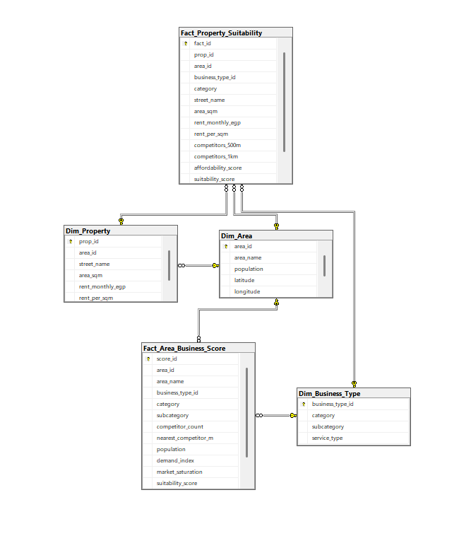

# 🏙️ SmartCity — Phase 3: DWH & SQL Server Load

> **نظرة عامة:** هذه المرحلة تنقل جداول الـ Gold المُنتجة من Phase 2 إلى **SQL Server** وتبني عليها **Data Warehouse** كامل جاهز للتحليل والـ Reporting.

---

## 📐 المعمارية العامة

```
Gold Output (Phase 2)
 CSV / XLSX files
        │
        ▼
  load_to_sqlserver.ipynb
  (SQLAlchemy + pyodbc)
        │
        ▼
  SQL Server — SmartCity DB
        │
        ├─► Dim_Area
        ├─► Dim_Business_Type
        ├─► Dim_Property
        ├─► Fact_Area_Business_Score
        └─► Fact_Property_Suitability
                │
                ▼
         DWH Schema (dwh/)
         Keys, Constraints, Indexes
```

---

## 🗂️ هيكل المجلد

```
phase3_dwh/
│
├── load_to_sqlserver.ipynb       ← رفع الجداول من الملفات لـ SQL Server
│
├── dwh/
│   ├── 01_create_schema.sql      ← إنشاء الـ Schema
│   ├── 02_create_tables.sql      ← إنشاء الجداول بـ types صحيحة
│   ├── 03_constraints.sql        ← Primary Keys + Foreign Keys
│   ├── 04_indexes.sql            ← Indexes لتسريع الاستعلامات
│   └── erd_diagram.png           ← مخطط العلاقات
│
└── README.md
```

---

## 📓 load_to_sqlserver.ipynb

### Cell 1 — تثبيت المتطلبات

```python
pip install sqlalchemy pyodbc openpyxl
```

---

### Cell 2 — إعدادات الاتصال

عدّل السطرين دول فقط قبل التشغيل:

| المتغير | القيمة الافتراضية | الوصف |
|---|---|---|
| `DB_SERVER` | `NORASALMA\MSSQLSERVER01` | اسم الـ instance من SSMS |
| `DB_NAME` | `SmartCity` | اسم الـ database |
| `DB_DRIVER` | `ODBC Driver 17 for SQL Server` | إصدار الـ ODBC driver |
| `FILES_DIR` | `C:\Users\...\Downloads` | المجلد اللي فيه ملفات الـ CSV/XLSX |

> ⚠️ تأكد إن الـ ODBC Driver مثبّت على جهازك — حمّله من [Microsoft ODBC Driver for SQL Server](https://learn.microsoft.com/en-us/sql/connect/odbc/download-odbc-driver-for-sql-server).

---

### Cell 3 — اختبار الاتصال

بيعمل `SELECT 1` على الـ database — لو طلع ✅ يبقى الاتصال شغّال وتقدر تكمّل.

```python
engine = create_engine(
    f"mssql+pyodbc://{DB_SERVER}/{DB_NAME}"
    f"?driver={DB_DRIVER}&trusted_connection=yes&TrustServerCertificate=yes",
    fast_executemany=True    # ← batch insert أسرع بكتير
)
```

**`trusted_connection=yes`** → بيستخدم Windows Authentication (مش username/password).  
**`TrustServerCertificate=yes`** → بيتجنّب مشاكل الـ SSL على الـ local instances.

---

### Cell 4 — رفع الجداول

بيرفع 5 جداول بالترتيب ده:

| الجدول | الملف | الحجم المتوقع |
|---|---|---|
| `Dim_Area` | `Dim_Area.csv` | ~50 صف |
| `Dim_Business_Type` | `Dim_Business_Type.csv` | ~13 صف |
| `Dim_Property` | `Dim_Property.csv` | ~35 صف |
| `Fact_Area_Business_Score` | `Fact_Area_Business_Score.csv` | ~650 صف |
| `Fact_Property_Suitability` | `Fact_Property_Suitability.xlsx` | ~455 صف |

**السلوك:**
- `if_exists="replace"` → بيحذف الجدول لو موجود ويعيد إنشاءه (مناسب للـ development).
- `chunksize=500` → بيرفع 500 صف كل مرة عشان ميقعش في مشاكل الـ memory.
- لو ملف مش موجود → تحذير ⚠️ والـ notebook يكمّل بدون crash.

---

## 🏗️ DWH Schema

### ERD Diagram



### نموذج البيانات (Star Schema)

```
                    Dim_Area
                   (area_id PK)
                        │
                        │ FK
                        ▼
Dim_Business_Type ──► Fact_Area_Business_Score
(business_type_id PK)  (score_id PK)

Dim_Property ──────► Fact_Property_Suitability
(prop_id PK)          (fact_id PK)
    │
    └── FK → Dim_Area
```

### الجداول والـ Schema الكامل

**Dim_Area**
```sql
CREATE TABLE Dim_Area (
    area_id    INT           PRIMARY KEY,
    area_name  NVARCHAR(200) NOT NULL,
    population BIGINT,
    latitude   FLOAT,
    longitude  FLOAT
);
```

**Dim_Business_Type**
```sql
CREATE TABLE Dim_Business_Type (
    business_type_id INT           PRIMARY KEY,
    category         NVARCHAR(100) NOT NULL,
    subcategory      NVARCHAR(100) NOT NULL,
    service_type     NVARCHAR(100)
);
```

**Dim_Property**
```sql
CREATE TABLE Dim_Property (
    prop_id          INT           PRIMARY KEY,
    area_id          INT           REFERENCES Dim_Area(area_id),
    street_name      NVARCHAR(300),
    area_sqm         INT,
    rent_monthly_egp INT,
    rent_per_sqm     FLOAT
);
```

**Fact_Area_Business_Score**
```sql
CREATE TABLE Fact_Area_Business_Score (
    score_id             INT   PRIMARY KEY,
    area_id              INT   REFERENCES Dim_Area(area_id),
    area_name            NVARCHAR(200),
    business_type_id     INT   REFERENCES Dim_Business_Type(business_type_id),
    category             NVARCHAR(100),
    subcategory          NVARCHAR(100),
    competitor_count     INT,
    nearest_competitor_m INT,
    population           BIGINT,
    demand_index         INT,
    market_saturation    FLOAT,
    suitability_score    FLOAT,
    recommended          BIT
);
```

**Fact_Property_Suitability**
```sql
CREATE TABLE Fact_Property_Suitability (
    fact_id              INT   PRIMARY KEY,
    prop_id              INT   REFERENCES Dim_Property(prop_id),
    area_id              INT   REFERENCES Dim_Area(area_id),
    business_type_id     INT   REFERENCES Dim_Business_Type(business_type_id),
    category             NVARCHAR(100),
    street_name          NVARCHAR(300),
    area_sqm             INT,
    rent_monthly_egp     INT,
    rent_per_sqm         FLOAT,
    competitors_500m     INT,
    competitors_1km      INT,
    affordability_score  FLOAT,
    suitability_score    FLOAT,
    recommended          BIT
);
```

---

## 🔍 Indexes الأساسية

```sql
-- أكتر الاستعلامات شيوعاً في التحليل
CREATE INDEX IX_FactArea_recommended  ON Fact_Area_Business_Score (recommended, suitability_score DESC);
CREATE INDEX IX_FactArea_area         ON Fact_Area_Business_Score (area_id, category);
CREATE INDEX IX_FactProp_recommended  ON Fact_Property_Suitability (recommended, suitability_score DESC);
CREATE INDEX IX_FactProp_area         ON Fact_Property_Suitability (area_id, category);
CREATE INDEX IX_DimProp_area          ON Dim_Property (area_id);
```

---

## 🛠️ المتطلبات التقنية

```
SQL Server     2019 / 2022  (أو Express)
ODBC Driver    17 for SQL Server
Python         3.x
```

**Python Packages:**
```
sqlalchemy
pyodbc
openpyxl
pandas
```

---

## 🚀 طريقة التشغيل

```bash
# 1. تأكد إن SQL Server شغّال وعندك SmartCity database
# 2. حط ملفات الـ Gold في FILES_DIR
# 3. شغّل الـ cells بالترتيب:

Cell 1 → تثبيت المكتبات
Cell 2 → تعديل إعدادات الاتصال (DB_SERVER + FILES_DIR)
Cell 3 → اختبار الاتصال ✅
Cell 4 → رفع الجداول

# 4. افتح SSMS وتأكد إن الجداول موجودة
# 5. شغّل dwh/*.sql لإضافة الـ constraints والـ indexes
```

---

## ✅ Checklist ما بعد الرفع

```
□ Dim_Area                 → ~50  صف
□ Dim_Business_Type        → ~13  صف
□ Dim_Property             → ~35  صف
□ Fact_Area_Business_Score → ~650 صف
□ Fact_Property_Suitability→ ~455 صف
□ Foreign Keys مضبوطة (dwh/03_constraints.sql)
□ Indexes موجودة   (dwh/04_indexes.sql)
□ استعلام تجريبي: SELECT * FROM Fact_Area_Business_Score WHERE recommended = 1
```

---

*SmartCity Phase 3 — Alexandria Business Intelligence Platform*
